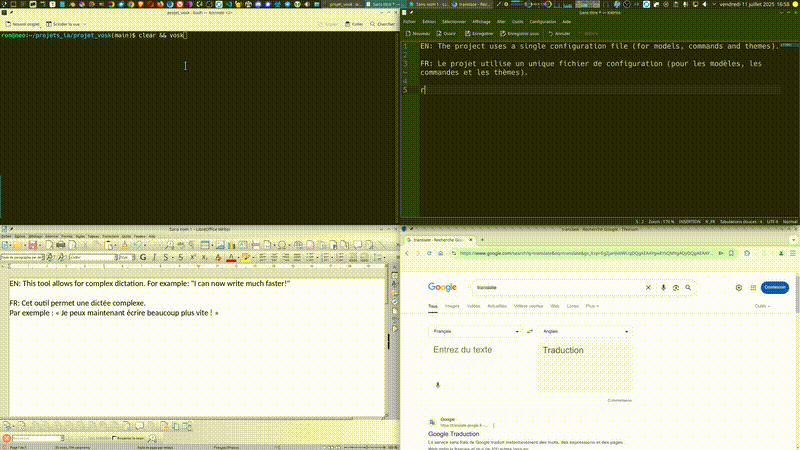

# Vosk-CLI-Dictation

<p align="center">
  <a href="https://github.com/RonanDavalan/vosk-cli-dictation/blob/main/LICENSE"></a>
  <a href="#"></a>
  <a href="#"></a>
  <a href="#"></a>
  <a href="#"></a>
</p>

<p align="center">
  <a href="https://vosk.davalan.fr/"><strong>➡️ Visit the Official Homepage for a full tour!</strong></a>
</p>

<p align="center">
  
</p>

A powerful and customizable command-line dictation tool for Linux, powered by the Vosk engine. Turn your speech into text directly in your terminal and have it appear in any application.

---

## ✨ Why This Project?

This tool was born from the need for a robust, locally-run dictation system on GNU/Linux that gives the user full control over their data and the software's behavior. Unlike cloud-based solutions, it operates **100% offline**, guaranteeing your privacy.

## 🚀 Key Features

*   **System-Wide Integration:** Dictate into any active application (terminal, browser, code editor, etc.).
*   **Multi-Language Support:** Works out-of-the-box with **English** and **French**.
*   **Total Control:** Use global hotkeys, voice commands, and manual controls to manage your dictation.
*   **Fully Customizable:** Configure UI colors, hotkeys, voice commands, and recognition aliases in a simple `config.yaml` file.
*   **Full Punctuation:** Dictate a complete range of punctuation with natural voice commands.
*   **Private and Offline:** Runs entirely on your machine. Your voice data never leaves your computer.

> [!WARNING]
> 
> **Compatibility Note: X11 vs. Wayland** This application uses `xdotool` for keyboard simulation, which is primarily designed for the **X11 display server**. While it may **not work natively** on systems running **Wayland** by default (such as recent versions of Fedora or Ubuntu), some compatibility can be achieved through **XWayland**, which provides X11 compatibility layer on Wayland systems. For full compatibility, ensure you have an X11 session, though basic functionality might work under Wayland with XWayland.

## ⚙️ Getting Started

### 1. System Dependencies

This project was developed and tested on **Debian 12 (Bookworm)**. You will need the following packages:

```bash
sudo apt-get update && sudo apt-get install python3-pip python3-venv portaudio19-dev gettext xdotool pulseaudio-utils
```

### 2. Project Setup

Clone the repository and create the Python virtual environment.

```bash
git clone https://github.com/RonanDavalan/vosk-cli-dictation.git
cd vosk-cli-dictation
python3 -m venv venv
source venv/bin/activate
```

### 3. Install Python Dependencies

Install the required Python packages from the `requirements.txt` file.

```bash
pip install -r requirements.txt
```

### 4. Download Language Models

This project requires Vosk language models to function. They are not included in the repository and must be downloaded manually.

1.  **Download the models you need:** We recommend starting with the small models for efficiency.
    *   **French Model:** [vosk-model-small-fr-0.22](https://alphacephei.com/vosk/models/vosk-model-small-fr-0.22.zip)
    *   **English Model:** [vosk-model-small-en-us-0.15](https://alphacephei.com/vosk/models/vosk-model-small-en-us-0.15.zip)

2.  **Unzip and place them correctly:** After unzipping, the model folders (e.g., `vosk-model-small-fr-0.22`) must be placed directly inside the `vosk-model/` directory of the project.

### 5. Launch The Application

With the virtual environment still active, run the main script.

```bash
# To run with the French model (default in config)
python3 src/main.py

# To explicitly run with the English model
python3 src/main.py -l en
```

### 💡 Pro Tip: Create a Quick-Launch Command (Optional)

For easier access, you can add a function to your shell's configuration file (e.g., `~/.bashrc` or `~/.zshrc`).

1.  Open your configuration file: `nano ~/.bashrc`
2.  Add the following lines at the end. **Remember to replace `/path/to/your/vosk-cli-dictation` with the actual, absolute path to the project directory.**

    ```bash
    # Defines a 'vosk' command to launch the dictation script easily.
    vosk() {
        # Check if the project directory exists
        if [ -d "/path/to/your/vosk-cli-dictation" ]; then
            cd "/path/to/your/vosk-cli-dictation" && \
            source venv/bin/activate && \
            python3 src/main.py "$@" && \
            deactivate
        else
            echo "Error: Project directory not found at /path/to/your/vosk-cli-dictation"
        fi
    }
    ```

3.  Apply the changes by running `source ~/.bashrc` or by opening a new terminal.
4.  You can now launch the application from anywhere by simply typing `vosk` or `vosk -l en`.

## 🛠️ Usage & Configuration

### Language Selection

The language model is chosen based on the following priority:

1.  **Command-Line Flag (Highest Priority):** Use `-l en` or `-l fr` to force a specific language for the session.
2.  **Default in `config.yaml` (Fallback):** If no flag is used, the `default_model` from `config/config.yaml` is loaded.

### Manual Commands

While the script is running, you can type these commands in its terminal window and press Enter:

*   `/cancel`: Stops the current recording session without outputting text.
*   `/delete-word`: Deletes the last typed word.
*   `/nl`: Inserts a new line (simulates pressing the Enter key).

### Customization

All settings can be modified in the `config/config.yaml` file. This includes hotkeys, UI colors, voice commands, and recognition aliases.

## 🤝 Contributing

This project is open source and contributions are highly encouraged! Please check out our **[Contribution Guide](CONTRIBUTING.md)** and feel free to open an issue on the [issues page](https://github.com/RonanDavalan/vosk-cli-dictation/issues).

## 📄 License

This project is licensed under the **MIT License**. See the [LICENSE](LICENSE) file for details.